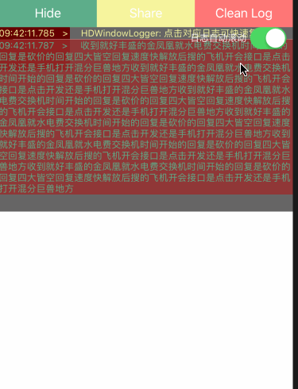
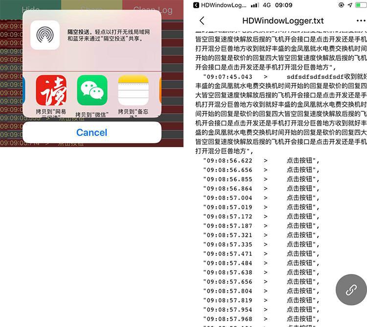

# HDWindowLogger


iOS端将输出日志log悬浮显示在屏幕上，可以生成日志文件分享，便于在真机没有连接xcode的情况下调试信息。可以分享、筛选log等操作

The iOS side displays the output log log on the screen, and can generate log file sharing, which is convenient for debugging information when the real machine is not connected to xcode. Log information can be filtered and shared

### [Document for English](#english) | [Swift Version](https://github.com/DamonHu/HDWindowLoggerSwift)

### [中文文档](#chinese) | [Swift版本](https://github.com/DamonHu/HDWindowLoggerSwift)


<span id = "english"></span>

## Introduction to English


Project address: [https://github.com/DamonHu/HDWindowLogger](https://github.com/DamonHu/HDWindowLogger)

Display effect gif:



In addition to displaying on the screen, you can set whether to automatically scroll the log for debugging, or you can share the output log to WeChat, twitter, etc. for offline viewing. At the same time, you can search for output content, handle it yourself, etc.



## I. Installation

You can choose to install using cocoaPod, or you can download the source file directly into the project.

### 1.1, cocoaPod installation

```
pod 'HDWindowLogger'
```

### 1.2, file installation

You can drag the files in the `HDWindowLogger` folder to the project under the project.

## II. Use

### 1、Import header file

```
#import "HDWindowLogger.h"
```

### 2、 display the floating window

```
[HDWindowLogger show];
```

### 3 、 Print log content

The font colors of the three output methods are different, and the corresponding types of printLog are different.

```
HDNormalLog(@"点击按钮"); 	//Log's textColor is green
HDWarnLog(@"点击按钮");		//log's textColor is yellow
HDErrorLog(@"点击按钮");		//Log's textColor is red
```

Output format

```
13:45:00.153  >   点击按钮
```

## III. more settings

### 1、Set whether to output all information


```
[HDWindowLogger defaultWindowLogger].mCompleteLogOut = true;
```

If set to output all debugging information, the output format is as follows, including the output file, the number of lines called, and the function called

```
10:00:07.268   >     [File:(ViewController.m)]:[Line:(49):[Function:(-[ViewController p_click])]]-Log:
点击按钮
```

### 2、 Whether to output content synchronously in the debug bar at the bottom of xcode

```
[HDWindowLogger defaultWindowLogger].mDebugAreaLogOut = true
```

### 3、Get the log information content

```
[HDWindowLogger defaultWindowLogger].mLogDataArray
```

### 4、Clear the log

```
[HDWindowLogger cleanLog];
```

### 5, hide the entire log window

```
[HDWindowLogger hide];
```

### 6, only hide the log output window

```
[HDWindowLogger hideLogWindow];
```

### 7, set the log maximum number of records, 0 is not limited，default value is 0

```
[HDWindowLogger setMaxLogCount:100];
```

## III. Other instructions

1. For the convenience of viewing, it is divided into three types: normal, warning and error. It corresponds to three different colors for easy viewing.
2. Click the corresponding cell to copy the output log directly to the system clipboard.
3. Share the system share that is called. Which software you can share depends on which software is installed on your phone.

<span id = "chinese"></span>

## 简体中文介绍

项目地址:[https://github.com/DamonHu/HDWindowLogger](https://github.com/DamonHu/HDWindowLogger)

开发微信小程序过程中，小程序的悬浮调试工具用起来调试特别舒服，想找一个iOS上的，找到了一个类似的[HAMLogOutputWindow](https://github.com/DaiYue/HAMLogOutputWindow)，看了下源码，是用的`textview`写的，但是并不能滚动查询和操作。同时考虑到打印网络请求输出量还是很大的，为了性能和后续拓展，所以用`Tableview`重写了一个。

展示效果gif图:


除了在屏幕上显示，可以设置是否自动滚动日志便于调试，也可以将输出的日志分享到微信、twitter等程序，以便离线查看。同时可以搜索输出内容，自己处理等


## 一、安装

你可以选择使用cocoaPod安装，也可以直接下载源文件拖入项目中

### 1.1、cocoaPod安装

```
pod 'HDWindowLogger'
```

### 1.2、文件安装

可以将工程底下，`HDWindowLogger`文件夹内的文件拖入项目即可

## 二、使用

简单三步即可调用显示

### 1、导入头文件

```
#import "HDWindowLogger.h"
```

### 2、显示悬浮窗


```
[HDWindowLogger show];
```

### 3、 打印日志内容

三种输出方式字体颜色显示不同，对应的printLog不同的类型

```
HDNormalLog(@"点击按钮"); 	//日志为绿色
HDWarnLog(@"点击按钮");		//日志为黄色
HDErrorLog(@"点击按钮");		//日志为红色
```

输出格式

```
13:45:00.153  >   点击按钮
```

## 三、更多设置

通过其他设置可以实现获取更多功能

### 1、设置是否输出全部信息

```
[HDWindowLogger defaultWindowLogger].mCompleteLogOut = true;
```

如果设置为输出全部调试信息，那么输出的格式是下面这样的，包含了输出文件、调用的行数、和调用的函数

```
10:00:07.268   >     [File:(ViewController.m)]:[Line:(49):[Function:(-[ViewController p_click])]]-Log:
点击按钮
```

### 2、是否在xcode底部的调试栏同步输出内容

```
[HDWindowLogger defaultWindowLogger].mDebugAreaLogOut = true
```

### 3、 获取log信息内容

```
[HDWindowLogger defaultWindowLogger].mLogDataArray
```

### 4、清空log

```
[HDWindowLogger cleanLog];
```

### 5、隐藏整个log窗口

```
[HDWindowLogger hide];
```

### 6、仅隐藏log输出窗口

```
[HDWindowLogger hideLogWindow];
```

### 7、设置log最大记录数，0为不限制，默认不限制

```
[HDWindowLogger setMaxLogCount:100];
```


## 三、其他说明

1. 为了查看方便，分为普通、警告、错误三种类型，对应了三种不同的颜色，方便查看
2. 点击对应的cell可以直接将输出log复制到系统剪贴板
3. 分享调用的系统分享，可以分享到哪个软件取决于你手机上安装的有哪些软件。