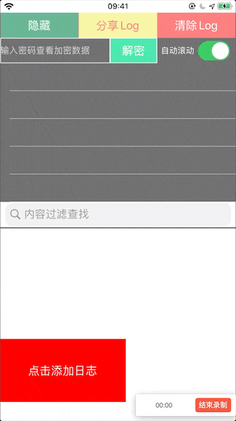
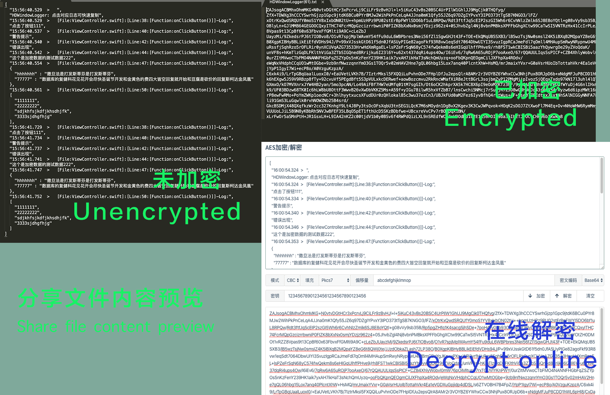
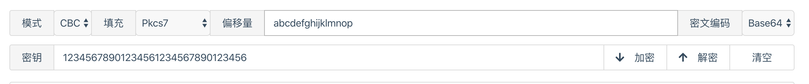

# HDWindowLogger


iOS端将输出日志log悬浮显示在屏幕上，可以生成日志文件分享，便于在真机没有连接xcode的情况下调试信息。可以分享、筛选log等操作。

The iOS side displays the output log log on the screen, and can generate log file sharing, which is convenient for debugging information when the real machine is not connected to xcode. Log information can be filtered and shared

**2.0版本开始采用Masonry自动布局，如果不想引用，可以使用1.6.11版本。Version 2.0 began to use Masonry automatic layout, if you don't want to quote, you can use version 1.6.11.
**

### [Document for English](#english) | [Swift Version](https://github.com/ZXKitCode/logger)

### [中文文档](#chinese) | [Swift版本](https://github.com/ZXKitCode/logger)


<span id = "english"></span>

## Introduction to English


Project address: [https://github.com/DamonHu/HDWindowLogger](https://github.com/DamonHu/HDWindowLogger)

Display effect gif:



In addition to displaying on the screen, you can set whether to automatically scroll the log for debugging, or you can share the output log to WeChat, twitter, etc. for offline viewing. At the same time, you can search for output content, Sensitive content can be encrypted with a password, and shared files are also encrypted, and can be decrypted online with a password.



## I. Installation

You can choose to install using cocoaPod, or you can download the source file directly into the project.

### 1.1, cocoaPod installation

```
pod 'HDWindowLogger'
```

### 1.2, file installation

You can drag the files in the `HDWindowLogger` folder to the project under the project.

## II. Use

### 1、Import header file

```
#import "HDWindowLogger.h"
```

### 2、 display the floating window

```
[HDWindowLogger show];
```

### 3 、 Print log content

The font colors of the three output methods are different, and the corresponding types of printLog are different.

```
HDDebugLog(@"sss: %@",dic); 	//Debug output, the content will not be written to the window, only output in xcode
HDNormalLog(@"点击按钮"); 	//Log's textColor is green
HDWarnLog(@"点击按钮");		//log's textColor is yellow
HDErrorLog(@"点击按钮");		//Log's textColor is red
HDPrivacyLog (@"加密数据") // Output of encrypted data, the specific encryption method is described in the following encryption
```

Output format

```
13:45:00.153  >   点击按钮
```

## III. more settings

### 1、Set whether to output all information


```
[HDWindowLogger defaultWindowLogger].mCompleteLogOut = true;
```

If set to output all debugging information, the output format is as follows, including the output file, the number of lines called, and the function called

```
10:00:07.268   >     [File:(ViewController.m)]:[Line:(49):[Function:(-[ViewController p_click])]]-Log:
点击按钮
```

### 2、 Whether to output content synchronously in the debug bar at the bottom of xcode

```
[HDWindowLogger defaultWindowLogger].mDebugAreaLogOut = true
```

### 3、Get the log information content

```
[HDWindowLogger defaultWindowLogger].mLogDataArray
```

### 4、Clear the log

```
[HDWindowLogger cleanLog];
```

### 5, hide the entire log window

```
[HDWindowLogger hide];
```

### 6, only hide the log output window

```
[HDWindowLogger hideLogWindow];
```

### 7, set the log maximum number of records, 0 is not limited，default value is 0

```
[HDWindowLogger setMaxLogCount:100];
```

## IV. sensitive information output encryption and decryption

If there is sensitive information that you don't want users to see when debugging, you can set encryption in two simple steps

```
// 1. Set the encryption password,  32 characters
[HDWindowLogger defaultWindowLogger].mPrivacyPassword = @"12345678901234561234567890123456";

// 2, output encrypted content
HDPrivacyLog (@"This is test data 222 for encrypted data")
```

### 4.2 Decrypt the contents of the display window

After the setting, the display in the display window is `This content is encrypted, please view it after decryption`, enter the set encryption password and click decrypt to display the normal encrypted content.

### 4.1. Decrypting shared files

* If the data has been decrypted in the display window, the content of the shared file will not be encrypted at this time, and all content will be displayed.
* If it is not decrypted in the display window, the content of the file shared at this time is AES encrypted content, you can search the `AES Online Decryption Website` to decrypt the content, and the settings are as follows:



* Mode: CBC
* Fill: Pkcs7
* Data block: 128 bits
* Offset: `abcdefghijklmnop`
* Encoding: Base64
* Character set: UTF8
* Password: The password you set in the SDK yourself

Then click Decrypt.

Here are a few online sites recommended, you can also Google it by yourself

* [https://oktools.net/aes](https://oktools.net/aes)
* [http://tools.bugscaner.com/cryptoaes/](http://tools.bugscaner.com/cryptoaes/)
* [http://tool.chacuo.net/cryptaes](http://tool.chacuo.net/cryptaes)

## V. Other instructions

1. For the convenience of viewing, it is divided into three types: normal, warning and error. It corresponds to three different colors for easy viewing.
2. Click the corresponding cell to copy the output log directly to the system clipboard.
3. Share the system share that is called. Which software you can share depends on which software is installed on your phone.

<span id = "chinese"></span>

## 简体中文介绍

项目地址:[https://github.com/DamonHu/HDWindowLogger](https://github.com/DamonHu/HDWindowLogger)

开发微信小程序过程中，小程序的悬浮调试工具用起来调试特别舒服，想找一个iOS上的，找到了一个类似的[HAMLogOutputWindow](https://github.com/DaiYue/HAMLogOutputWindow)，看了下源码，是用的`textview`写的，但是并不能滚动查询和操作。同时考虑到打印网络请求输出量还是很大的，为了性能和后续拓展，所以用`Tableview`重写了一个。

展示效果gif图:


除了在屏幕上显示，可以设置是否自动滚动日志便于调试，也可以将输出的日志分享到微信、twitter等程序，以便离线查看。同时可以搜索输出内容，敏感内容可以设置密码进行加密，分享出来的文件也会进行加密，可以通过密码在线解密


## 一、安装

你可以选择使用cocoaPod安装，也可以直接下载源文件拖入项目中

### 1.1、cocoaPod安装

```
pod 'HDWindowLogger'
```

### 1.2、文件安装

可以将工程底下，`HDWindowLogger`文件夹内的文件拖入项目即可

## 二、使用

简单三步即可调用显示

### 1、导入头文件

```
#import "HDWindowLogger.h"
```

### 2、显示悬浮窗


```
[HDWindowLogger show];
```

### 3、 打印日志内容

三种输出方式字体颜色显示不同，对应的printLog不同的类型

```
HDDebugLog(@"sss: %@",dic); 	//调试输出，不会输出到窗口，只会显示在xcode调试区
HDNormalLog(@"点击按钮"); 	//日志为绿色
HDWarnLog(@"点击按钮");		//日志为黄色
HDErrorLog(@"点击按钮");		//日志为红色
HDPrivacyLog(@"点击按钮")	//加密数据的输出，具体加密方式在下面的加密中说明
```

输出格式

```
13:45:00.153  >   点击按钮
```

## 三、更多设置

通过其他设置可以实现获取更多功能

### 1、设置是否输出全部信息

```
[HDWindowLogger defaultWindowLogger].mCompleteLogOut = true;
```

如果设置为输出全部调试信息，那么输出的格式是下面这样的，包含了输出文件、调用的行数、和调用的函数

```
10:00:07.268   >     [File:(ViewController.m)]:[Line:(49):[Function:(-[ViewController p_click])]]-Log:
点击按钮
```

### 2、是否在xcode底部的调试栏同步输出内容

```
[HDWindowLogger defaultWindowLogger].mDebugAreaLogOut = true
```

### 3、 获取log信息内容

```
[HDWindowLogger defaultWindowLogger].mLogDataArray
```

### 4、清空log

```
[HDWindowLogger cleanLog];
```

### 5、隐藏整个log窗口

```
[HDWindowLogger hide];
```

### 6、仅隐藏log输出窗口

```
[HDWindowLogger hideLogWindow];
```

### 7、设置log最大记录数，0为不限制，默认不限制

```
[HDWindowLogger setMaxLogCount:100];
```

## 四、 敏感信息输出加密和解密

如果存在敏感信息，不希望用户或者手机调试时看到，简单两步就可以设置加密

```
//1、设置加密密码，32个字符数字
[HDWindowLogger defaultWindowLogger].mPrivacyPassword = @"12345678901234561234567890123456";

//2、输出加密内容
HDPrivacyLog(@"这个是加密数据的测试数据222")
```

### 4.2、显示窗内容解密

设置之后，在显示窗中的显示为`该内容已加密，请解密后查看`，输入设置的加密密码然后点击解密之后即可显示正常的加密内容。

### 4.1、 分享文件解密

* 如果已经在显示窗解密了数据，此时分享的文件内容不会加密，会显示所有内容。
* 如果在显示窗中未解密，此时分享出的文件内容为AES加密内容，可以搜索`AES在线解密的网站`去解密内容，设置参照下图：


* 模式: CBC
* 填充: Pkcs7
* 数据块: 128位
* 偏移量: abcdefghijklmnop
* 编码: Base64
* 字符集: UTF8
* 密码: 你自己在sdk中设置的密码

然后点击解密即可。

这里推荐几个在线的网站，你也可以自己百度

* [https://oktools.net/aes](https://oktools.net/aes)
* [http://tools.bugscaner.com/cryptoaes/](http://tools.bugscaner.com/cryptoaes/)
* [http://tool.chacuo.net/cryptaes](http://tool.chacuo.net/cryptaes)


## 五、其他说明

1. 为了查看方便，分为普通、警告、错误三种类型，对应了三种不同的颜色，方便查看
2. 点击对应的cell可以直接将输出log复制到系统剪贴板
3. 分享调用的系统分享，可以分享到哪个软件取决于你手机上安装的有哪些软件。
